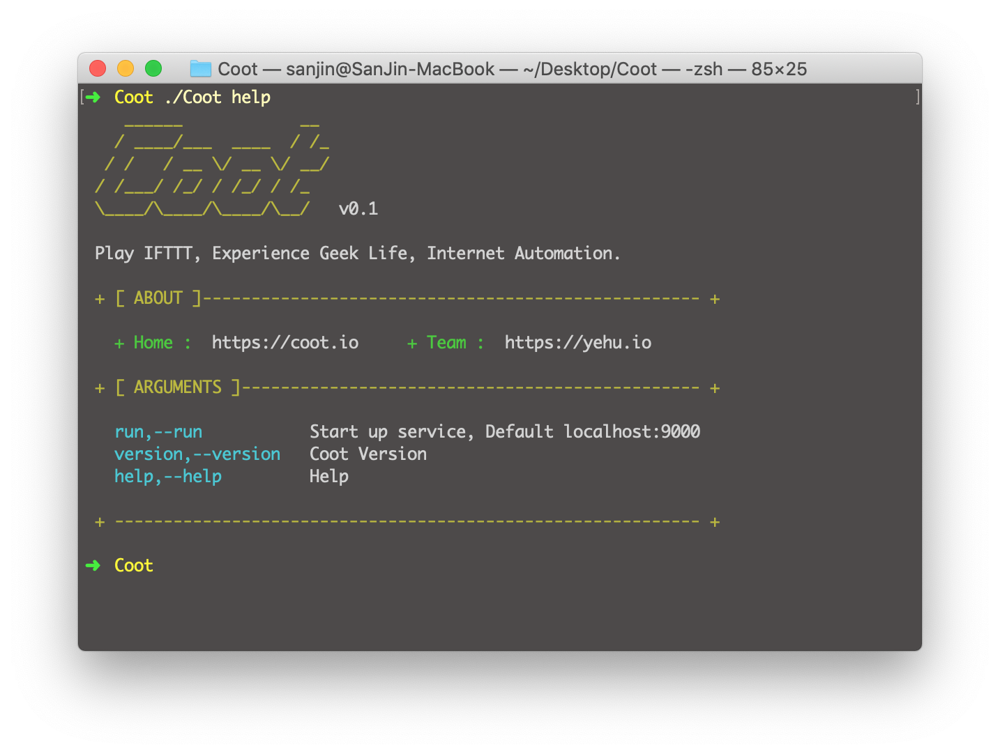

# 介绍

**Coot** 是一款 **IFTTT** 自动化神器，基于 **Golang** 开发让你体验不同的极客生活。

- **快速安装** 基于 **Golang** + **SqlLite** 开发，用户可在 **Linux** 和 **Mac** 上快速部署
- **两种语言** 支持 **Python** + **Shell** 两种语言 让用户更多的选择
- **插件库** 基于 **Github** 实现云插件库，用户无需编写代码直接使用

# 地址

- 官网：https://coot.io
- Github：https://github.com/yehux/Coot
- 下载地址：https://github.com/yehux/Coot/releases
- 插件库地址：https://github.com/yehux/Coot-Plugs

# 部署说明

> 下载软件到 **Linux** or **Mac**下解压

输入 

```
./coot help
```



运行

```
./coot run

or

./coot run 0.0.0.0:9000
```


# 使用截图


# 注意事项

- 邮箱 **SMTP** 配置后需要开启方可使用
- 创建任务需要开启邮箱通知填写接收邮箱（可写多个）
- 编写脚本 输出结果 0&&测试 ，没有0&& 不会进行通知
- 服务重启后，所有任务都会变成停止状态
- 目前无登录功能，对互联网开放请自设置安全限制

# Todo

- [x] 任务中心
- [x] 任务添加
- [x] 任务删除
- [x] 任务执行
- [x] 任务暂停
- [x] 支持 Shell+Python
- [x] 支持 秒
- [x] 支持 分钟
- [x] 支持 小时
- [x] 支持每天指定时间
- [x] 支持每月指定时间
- [x] 插件仓库
- [x] 插件列表
- [x] 插件使用
- [x] 消息通知
- [x] 仪表盘统计
- [x] 日记记录
- [x] 启动命令行
- [x] 自定义 ip 端口
- [x] 任务详情
- [x] 任务修改
- [x] 支持更多的通知方式
- [x] 是否启用登录
- [ ] 平台统计
- [ ] 手机版本优化

# 关于

- 出品：野虎团队
- URL：https://yehu.io

# 反馈群：

加微信拉人，请备注 **野虎**


